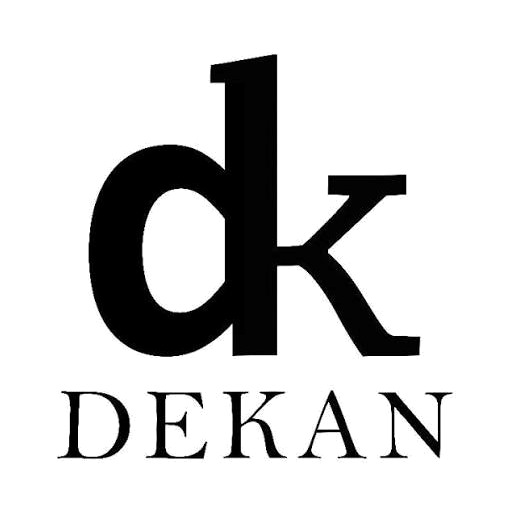
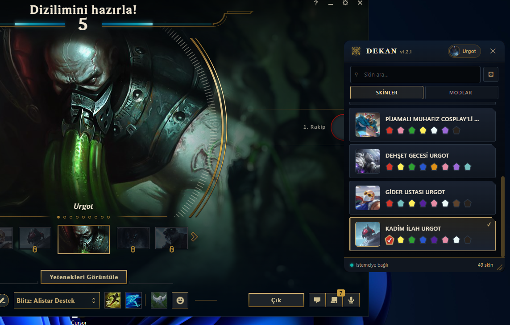
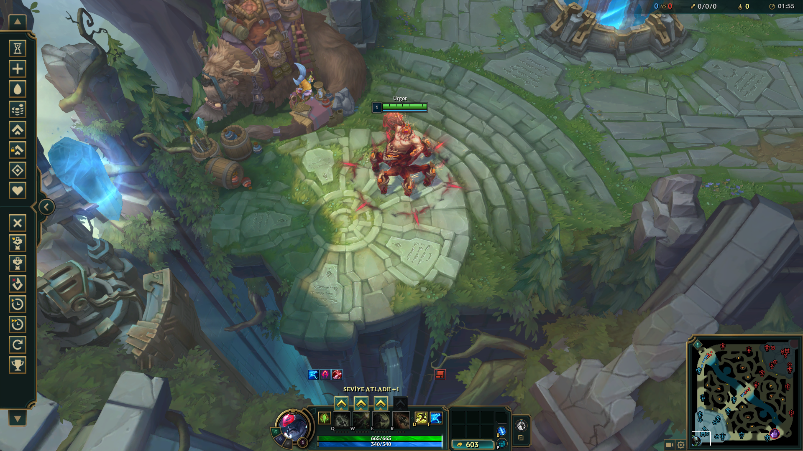

<p align="center">
  
</p>

<h1 align="center">Dekan</h1>

<p align="center">
  A League of Legends skin changer for Windows, written in Rust.<br>
  <em>The right skin loads into the match — every mode, every time.</em>
</p>

<p align="center">
  <a href="https://github.com/chrisssst/Dekan/actions/workflows/ci.yml"></a>
  <a href="https://scorecard.dev/viewer/?uri=github.com/chrisssst/Dekan"></a>
  <a href="https://github.com/chrisssst/Dekan/releases/latest"></a>
  <a href="https://github.com/chrisssst/Dekan/releases/latest"></a>
  
  
  
  <a href="https://discord.gg/kutsal"></a>
</p>

<p align="center">
  <a href="https://github.com/chrisssst/Dekan/releases/latest"><b>Download</b></a> ·
  <a href="https://discord.gg/kutsal"><b>Discord community</b></a> ·
  <a href="https://github.com/chrisssst/Dekan/issues"><b>Report a bug</b></a>
</p>

---

Dekan lets you use any skin during a match. You pick the skin in Dekan's own window during champion select.
Dekan then builds a copy of the game files that contain it, and when the game starts it opens that copy instead
of its own files. The game installation itself is never modified.

Dekan was inspired by [Rose](https://github.com/Alban1911/Rose), a Python project that sparked the idea of rebuilding the concept in Rust. It became an opportunity to apply and deepen my Rust knowledge while designing the project from the ground up, with one goal: the skin you choose is the skin you get in every game mode.

<p align="center">
  
  
</p>

> [!IMPORTANT]
> **Educational project.** Dekan is an improved skin changer built in Rust to study and demonstrate how such a
> tool can be engineered safely and reliably. It is provided as is, without warranty, and the author accepts
> no responsibility for any damage, account penalty or loss caused to you or to third parties by its use. See
> the [Disclaimer](#disclaimer).

## Contents

- [Contents](#contents)
- [Features](#features)
- [Why Dekan](#why-dekan)
- [Installation](#installation)
  - [Requirements](#requirements)
  - [Step 1 — Install Dekan](#step-1--install-dekan)
  - [Step 2 — Add the injector](#step-2--add-the-injector)
    - [A. Get LTK Manager](#a-get-ltk-manager)
    - [B. Copy the two files with File Explorer](#b-copy-the-two-files-with-file-explorer)
    - [B (alternative). Copy the two files with PowerShell](#b-alternative-copy-the-two-files-with-powershell)
    - [Direct download (alternative)](#direct-download-alternative)
    - [C. Check the files](#c-check-the-files)
  - [Step 3 — Start Dekan](#step-3--start-dekan)
- [Usage](#usage)
  - [Custom mods](#custom-mods)
  - [Party mode](#party-mode)
  - [Environment variables](#environment-variables)
- [How it works](#how-it-works)
- [Status](#status)
- [Where Dekan keeps its files](#where-dekan-keeps-its-files)
- [Security and risk](#security-and-risk)
  - [What Dekan does to keep you safe](#what-dekan-does-to-keep-you-safe)
  - [What you should know](#what-you-should-know)
- [Troubleshooting](#troubleshooting)
- [Community](#community)
- [Contact](#contact)
- [Project layout](#project-layout)
- [Building from source](#building-from-source)
- [CI/CD](#cicd)
  - [Publishing a release](#publishing-a-release)
- [Acknowledgements](#acknowledgements)
- [Disclaimer](#disclaimer)
- [License](#license)

## Features

- **Every skin, automatically.** Pick any skin or chroma in Dekan's window during champion select; it loads
  when the game starts. No clicks in the client, no files to swap.
- **Chromas and special forms.** Chromas and form skins such as Spirit Blossom Morgana, Sahn-Uzal Mordekaiser
  and Radiant Sett.
- **Random skin and history.** Roll a random skin, or let Dekan reuse the last skin you played on each
  champion.
- **Skins you own keep their name.** An owned skin is registered with the client, so your loading card shows
  its real name.
- **Custom mods.** `.fantome` mods in ten categories (skins, maps, fonts, announcers, UI, voiceover, loading
  screens, VFX, SFX, others), checked against the current patch before use.
- **Classic Rift.** Legacy champion models, generated from your installed game.
- **Party mode.** Friends on your team see each other's skins, through an end-to-end encrypted relay.
- **Always up to date.** Skins are generated from the game you have installed, so a patch never leaves you with
  outdated skin files.
- **In your language.** The interface is available in Turkish and English, with Turkish as the default.
- **New version notice.** When a new release is published, Dekan tells you once in a Windows notification and
  keeps a download link in the control panel. It never downloads or installs anything by itself.
- **Free and open source.** Dekan costs nothing. If you paid for it, you were scammed.

## Why Dekan

| | Dekan | Python changers with client plugins (e.g. Rose) | In-memory changers (e.g. R3nzSkin) | General mod managers (cslol-manager, LTK Manager) |
| --- | --- | --- | --- | --- |
| Picks the skin for you in champion select | Yes, automatically | Yes | Yes | No, you install mods by hand |
| Code running inside the League client | **None** | Plugin loader injected into the client | None | None |
| Writes to game memory | **No** | No | Yes, the approach that got such tools detected | No |
| Skins generated from your installed game on each patch | **Yes** | No, pre-built skin packages | Not applicable | No, pre-built mods |
| Unchanged game data kept byte for byte in the overlay | **Yes** | No, archives are recompressed | Not applicable | Depends on the tool |
| Runtime | One native executable | Python runtime plus a JavaScript plugin loader | Native DLL inside the game | Native application |

What that means in practice:

| | How Dekan gets there |
| --- | --- |
| **Security** | Runs without administrator rights. Never writes to the game folder. Loads its injector only after checking its SHA-256 against an audited build. No telemetry. Party mode data is end-to-end encrypted, so the relay cannot read it. |
| **Robustness** | The overlay keeps every untouched byte exactly as the game shipped it, which is what patch 16.19 requires. Mods broken by a patch are dropped before they can crash the loading screen. Dekan never suspends or touches the game process; it only prepares files the game reads. Every error is logged with its cause. |
| **Performance** | Written in Rust with no garbage collector or interpreter. The index of the game's archives is built in the background at startup. Built overlays are reused while the game build is unchanged, and entries identical to the game's are left out. |
| **Dynamic** | Finds the game on any drive or region, follows the client's language, re-reads your champion right before building (ARAM swaps, trades, last-second locks), and rebuilds itself after every patch with no manual update of skin packages. |
| **Independence** | One self-contained program. No client plugin loader, no Python runtime, no files read from other tools. The only external piece is the injector, loaded from Dekan's own folder. |
| **Transparency** | Open source under MIT, with CI and security scanning on every change and release installers you can verify with a checksum and a build provenance attestation. |

## Installation

Setup takes three steps: install Dekan, add the injector, start Dekan.

### Requirements

| Requirement | Notes |
| --- | --- |
| Windows 10 or 11, 64-bit | |
| [WebView2 Runtime](https://developer.microsoft.com/en-us/microsoft-edge/webview2/) | Already present on Windows 11. On Windows 10, install it if it is missing |
| League of Legends | Any install location. Dekan finds the game on its own |

### Step 1 — Install Dekan

1. Download `Dekan-Setup-<version>-x64.exe` from [Releases](https://github.com/chrisssst/Dekan/releases).
2. Optional but recommended: check that the download is intact. Compare the result with the `SHA256SUMS` file
   published next to the installer:

   ```powershell
   Get-FileHash .\Dekan-Setup-<version>-x64.exe -Algorithm SHA256
   ```

3. Run the installer. Windows asks for administrator permission **once, to install** into
   `C:\Program Files\Dekan`. Dekan itself never runs as administrator.

### Step 2 — Add the injector

Dekan needs two files made by League Toolkit, `ltk_patcher_host.exe` and `ltk_patcher_dll.dll`. They are not
included in Dekan's installer. There are two ways to get them; both end with the two files in
`C:\Program Files\Dekan\tools`:

| Option | How | Best for |
| --- | --- | --- |
| **Official** (recommended) | Install [LTK Manager](https://github.com/LeagueToolkit/ltk-manager) and copy the files from it (steps A–C below) | Getting the files straight from their authors |

Whichever you use, Dekan checks both files' SHA-256 at startup and refuses anything that is not the audited
build.

> [!IMPORTANT]
> Dekan only accepts the **exact build** it has audited. Today that is the build shipped with
> **LTK Manager 1.21.0 through 1.24.0** (the same two files in every one of them). Older versions contain a different build, which Dekan refuses. When a
> future LTK Manager changes these files, use the version named in the latest Dekan release notes.

#### A. Get LTK Manager

1. Open the [LTK Manager releases](https://github.com/LeagueToolkit/ltk-manager/releases) and download
   `LTK.Manager_1.24.0_x64-setup.exe` (or any version from 1.21.0 to 1.24.0).
2. Run it. By default it installs to `%LOCALAPPDATA%\LTK Manager`.
3. You do not need to use LTK Manager itself. Close it after installing, and do not start its patcher while
   Dekan is running: two injectors at once will conflict.

#### B. Copy the two files with File Explorer

1. Press `Win + R`, type `%LOCALAPPDATA%\LTK Manager` and press Enter. If it does not open, right-click the
   LTK Manager shortcut in the Start menu and choose **Open file location** (twice, if it opens the shortcut
   folder first).
2. Select `ltk_patcher_host.exe` and `ltk_patcher_dll.dll` and copy them (`Ctrl + C`).
3. Press `Win + R` again, type `C:\Program Files\Dekan\tools` and press Enter.
4. Paste (`Ctrl + V`). Windows asks for administrator permission because this is a protected folder; choose
   **Continue**.

#### B (alternative). Copy the two files with PowerShell

Open PowerShell **as administrator** (Start menu → type `PowerShell` → **Run as administrator**) and run:

```powershell
$from = Join-Path $env:LOCALAPPDATA 'LTK Manager'
$to   = Join-Path $env:ProgramFiles 'Dekan\tools'
Copy-Item (Join-Path $from 'ltk_patcher_host.exe'), (Join-Path $from 'ltk_patcher_dll.dll') $to -Force
Get-FileHash (Join-Path $to 'ltk_patcher_*') -Algorithm SHA256 | Format-Table Hash, Path -AutoSize
```

#### Direct download (alternative)

1. Right-click `tools.zip` → **Extract All…**.
2. Press `Win + R`, type `C:\Program Files\Dekan\tools` and press Enter.
3. Copy the two extracted files into that folder. Windows asks for administrator permission; choose
   **Continue**.
4. Check the hashes in step C below before starting Dekan. If they differ, delete the files and use the
   official option instead.

Or in PowerShell **as administrator**, from the folder where you downloaded the zip:

```powershell
$to = Join-Path $env:ProgramFiles 'Dekan\tools'
Expand-Archive .\tools.zip -DestinationPath $to -Force
Get-FileHash (Join-Path $to 'ltk_patcher_*') -Algorithm SHA256 | Format-Table Hash, Path -AutoSize
```

These files belong to League Toolkit and are covered by the
[LTK Patcher License](https://github.com/LeagueToolkit/ltk-manager/blob/main/LTK-PATCHER-LICENSE.md). The
download is a convenience mirror; it is not an official League Toolkit release.

#### C. Check the files

Optional for the official option, recommended for the direct download. The folder
`C:\Program Files\Dekan\tools` should now contain both files, with these SHA-256 hashes:

| File | SHA-256 |
| --- | --- |
| `ltk_patcher_host.exe` | `a7c4047ce7548c7ae820bc440735f15b9d1a495acf061dbb5a5a2893a0ed8d7c` |
| `ltk_patcher_dll.dll` | `07a43bf36a389eb00f6276e333bd7f2b95218f25a58e1e128ff4d2e4ab2dc99b` |

You do not have to check them by hand: Dekan checks both at startup. If one is missing or is a different
build, Dekan tells you and shows the exact path it expected. If you used LTK Manager, you can uninstall it
afterwards; the copies in Dekan's folder keep working.

### Step 3 — Start Dekan

Open Dekan from the Start menu, normally. Do not use **Run as administrator**. It lives in the system tray
next to the clock.

Uninstalling Dekan removes the program, its tools, logs, cache and generated files. The uninstaller asks
before it deletes your own skin library.

## Usage

1. Open the League client and Dekan, in either order.
2. Enter champion select and pick a champion. Dekan's window lists the skins and chromas available for it.
3. Choose one. Dekan builds the overlay and arms the injector while you are still in champion select.
4. Play.

From the tray icon you can open the mods and logs folders, create or join a party, and turn on start with
Windows.

### Custom mods

Drop `.fantome` mods into the category folders under `%LOCALAPPDATA%\Dekan\custom_mods`. The categories are
`skins`, `maps`, `fonts`, `announcers`, `ui`, `voiceover`, `loading_screen`, `vfx`, `sfx` and `others`. Then
select them in the **Mods** tab of Dekan's window. You can pick at most one skin, one map, one font and one
announcer at a time. The other categories can be combined.

Before a mod is used, Dekan checks that every internal reference it contains still exists in the current
game. After a patch, a mod whose references are gone is left out, with a warning, so it cannot crash the
loading screen.

### Party mode

One player creates a room from the tray and shares the invite code. Up to five players can join. Each player's
chosen skin is encrypted on their own machine before it is sent. The relay only passes the encrypted messages
along and never sees who the players are or which skins they picked. Dekan only accepts a teammate's skin when
that teammate's champion matches the one the client reports for your team. A player cannot push a skin onto a
champion they are not playing.

### Environment variables

| Variable | Effect |
| --- | --- |
| `DEKAN_LOG` | Log detail (`info` by default, `debug` to troubleshoot) |
| `DEKAN_RELAY_URL` | Party relay to use instead of the default one |
| `DEKAN_SKIN_SYNC` | A GitHub repository as `owner/repo` to download a skin library from in the background; off when unset |
| `DEKAN_PATCHER_FLAGS` | Advanced: numeric hook flags passed to the injector host |
| `DEKAN_UPDATE_CHECK` | `0` turns off the check for a new Dekan release; on when unset |

All of them are optional. [`.env.example`](.env.example) documents each one and how to set it on Windows.
Dekan reads them from the environment; it does not load a `.env` file.

## How it works

A match goes through the following steps:

1. **Dekan follows the League client.** The client runs a small local web server, the LCU, on `127.0.0.1`.
   Dekan reads its port and password from the client's lockfile. It then subscribes to the client's events to
   learn the game phase, your team and the champion you are playing.
2. **You choose a skin in Dekan's window.** When champion select opens, Dekan attaches its own window next to
   the client and lists the skins and chromas for your champion. Nothing is injected into the client: no
   plugins and no scripts.
3. **Dekan builds an overlay.** It generates the skin from the game you have installed: the skin's files are
   written over the champion's default ones. Dekan then builds modified copies of the game's `.wad.client`
   archives. Each changed file is replaced, and every other file keeps the exact bytes the game shipped with.
   That byte-for-byte fidelity is why the game accepts the overlay after a patch.
4. **The injector is armed before the game exists.** Dekan starts the injector host while you are still in
   champion select, so it is waiting when the game process appears.
5. **The game reads the overlay.** The injector DLL attaches to the game and redirects the reads of the archives
   Dekan rebuilt to the overlay copies. The skin loads. Only you can see it.

Just before building the overlay, Dekan checks the client again for your champion and selection. That way a
late swap (ARAM bench, trades, a pick in the last second) is not lost.

## Status

| Area | State |
| --- | --- |
| Injection on the current patch | Proven in a live match, running without administrator rights |
| Draft and Ranked | Proven in a live match |
| Blind pick, ARAM, Swiftplay, Arena, rotating modes, reconnect | Implemented, still being validated mode by mode |
| Classic Rift (legacy champion models) | Generated from the installed game |
| Party mode (friends see each other's skins) | Works against the public relay; not yet proven with several players in one match |

> **Heads up:** the injector DLL only accepts game builds up to a fixed date: it refuses any game executable
> built after 2026-10-04 07:00 UTC. The build you have installed keeps working after that date. The first patch
> built later needs a refreshed DLL. Dekan checks this at startup and tells you.

## Where Dekan keeps its files

```text
C:\Program Files\Dekan\              installed program (read-only for users)
├── dekan.exe
├── assets\dekan.ico
└── tools\                           injector: ltk_patcher_host.exe, ltk_patcher_dll.dll

%LOCALAPPDATA%\Dekan\                 everything Dekan writes, per Windows user
├── logs\                            daily logs, dekan.log.YYYY-MM-DD, last 7 days kept
├── custom_mods\                     your .fantome mods, one folder per category:
│   ├── skins\   maps\   fonts\   announcers\   ui\
│   └── voiceover\   loading_screen\   vfx\   sfx\   others\
├── library\                         skin library (generated or synced)
├── mods\                            mods generated from the game for the current match
├── overlay\                         built overlays, reused while the game build is unchanged
├── state\                           settings, party.json, selections
└── webview2\                        data of the selection window
```

- **Open them from the tray icon:** it has entries for the mods folder and the logs folder.
- **Logs** are the first thing to check, and to attach, when something fails. `DEKAN_LOG=debug` adds
  detail.
- **Tools** are looked for in `Program Files\Dekan\tools`, then in a `tools` folder next to `dekan.exe`, then
  in `%LOCALAPPDATA%\Dekan\tools`. Wherever they are found, they are only used if their SHA-256 matches the
  audited build. A file from another product's folder is never loaded.
- **The game folder is never written to.** Deleting `%LOCALAPPDATA%\Dekan` resets Dekan completely; the
  uninstaller does it for you.

## Security and risk

### What Dekan does to keep you safe

- It runs as a normal user. Only the installer, and copying the injector into `Program Files`, need
  administrator permission.
- It only loads its injector from its own folders, never from another product's. Before loading it, Dekan
  checks the file's SHA-256 hash against the one built into Dekan. A file that has been swapped is refused
  and logged.
- It never writes to the game folder. Everything it generates lives in `%LOCALAPPDATA%\Dekan`.
- It collects no telemetry. It only talks to the League client on your own machine, to GitHub to read the
  latest release number (off with `DEKAN_UPDATE_CHECK=0`) and, in party mode, to the relay. The relay only
  receives encrypted data.
- It never downloads or runs an update. A new release is only announced; you install it yourself.
- Every failure is logged with its cause in `%LOCALAPPDATA%\Dekan\logs`.

### What you should know

- The injector **is** a DLL loaded into the game, the same technique used by cslol-manager and LTK Manager. It
  changes which files the game opens. It does not touch game logic or game memory in any other way.
- No tool of this kind comes with a guarantee against penalties. **Use it at your own risk.**
- Windows SmartScreen may warn about the installer until it is code-signed.

Please report security issues privately through
[GitHub Security Advisories](https://github.com/chrisssst/Dekan/security/advisories/new), not in public issues.

## Troubleshooting

| Symptom | What to check |
| --- | --- |
| Dekan says a tool is missing or does not match | A file in `C:\Program Files\Dekan\tools` is missing or comes from another LTK Manager version. Redo [Step 2](#step-2--add-the-injector) with the version it names |
| The skin does not show up in game | Set `DEKAN_LOG=debug`, play again, and read the latest log in `%LOCALAPPDATA%\Dekan\logs` |
| The game opens its repair screen | Update Dekan, then report it with Dekan's log and the game's log from the same match |
| After a patch the injector refuses the game | The DLL does not support the new game build yet. Wait for a Dekan release that names a newer LTK Manager, then redo [Step 2](#step-2--add-the-injector) |
| The skin does not load and LTK Manager is open | Close LTK Manager: its patcher and Dekan's cannot run at the same time |

When you open an issue, attach the Dekan log from the match where it failed. Without it the problem is
usually impossible to diagnose. For quick help, ask on [Discord](https://discord.gg/kutsal).

## Community

Join the **[Dekan Discord](https://discord.gg/kutsal)** to get help with setup, report what works in each game mode, share
custom mods and hear about new builds first. Pre-releases are announced there before they are promoted, so
it is the best place to help test them.

Bugs with a log attached are best reported as [GitHub issues](https://github.com/chrisssst/Dekan/issues).
Want to help build it? Read [CONTRIBUTING.md](CONTRIBUTING.md). Everyone is expected to follow the
[Code of Conduct](CODE_OF_CONDUCT.md).

If Dekan is useful to you, **a star on GitHub** helps other players find it.

## Contact

The project is maintained by **Isllan Toso**: [isllan.dev](https://isllan.dev/).

For help and bug reports, the [Discord community](https://discord.gg/kutsal) and
[GitHub issues](https://github.com/chrisssst/Dekan/issues) are the fastest routes. Security issues go through a
[private advisory](https://github.com/chrisssst/Dekan/security/advisories/new).

## Project layout

Dekan is a Cargo workspace. Each crate has its own README with its role in the flow above.

| Module | Role |
| --- | --- |
| [`dekan-core`](crates/dekan-core) | Shared vocabulary: app state, game phases, champions, mods, task supervision |
| [`dekan-platform`](crates/dekan-platform) | Everything Windows: finding the game, processes, windows, tray, translations |
| [`dekan-wad`](crates/dekan-wad) | Reads and writes the game's archive and data formats |
| [`dekan-lcu`](crates/dekan-lcu) | Talks to the League client: phases, champion select, skin registration |
| [`dekan-classic`](crates/dekan-classic) | Generates skins and Classic Rift models from the installed game |
| [`dekan-inject`](crates/dekan-inject) | Builds the overlay and drives the injector |
| [`dekan-party`](crates/dekan-party) | Encrypted party rooms over a relay |
| [`dekan-relay`](crates/dekan-relay) | Optional self-hosted relay server |
| [`dekan-app`](crates/dekan-app) | The executable: wires everything together and decides when to inject |
| [`xtask`](xtask) | Build, packaging and diagnostic commands |
| [`relay-worker`](relay-worker) | The public party relay, running on Cloudflare Workers |
| [`installer`](installer) | Inno Setup script for the Windows installer |

Dependencies only flow in one direction. `dekan-core` and `dekan-wad` depend on no other Dekan crate. The
platform, LCU and party crates build on the core. `dekan-classic` builds on the WAD crate, `dekan-inject` on
the core, platform and WAD crates, and `dekan-app` on all of them.

## Building from source

You need Rust stable (the exact toolchain is pinned in `rust-toolchain.toml`, target `x86_64-pc-windows-msvc`).
To build the installer you also need [Inno Setup 6](https://jrsoftware.org/isinfo.php).

```powershell
cargo build --release     # target\x86_64-pc-windows-msvc\release\dekan.exe
cargo xtask check         # formatting, clippy with warnings as errors, tests, error-handling sweep
cargo deny check          # security advisories, licenses, banned crates, sources
cargo xtask package       # dist\ with checksums
cargo xtask installer     # dist\installer\Dekan-Setup-<version>-x64.exe
```

A passing build is not the finish line. A change that affects what happens inside the game is only done once
it has been seen working in a real match, with the log to prove it.

## CI/CD

Pull requests are checked automatically, and after a maintainer approves one it merges and ships on its own,
with safety nets in case the approval was a mistake.

| Workflow | Runs on | What it does |
| --- | --- | --- |
| [`ci.yml`](.github/workflows/ci.yml) | Every push and pull request | Tests on Windows, release build with metadata and manifest checks, dependency audit, relay typecheck, workflow lint and audit |
| [`security.yml`](.github/workflows/security.yml) | Pull requests, `main`, weekly | CodeQL, secret scan over the whole history, dependency review |
| [`pr-approved.yml`](.github/workflows/pr-approved.yml) and [`automerge.yml`](.github/workflows/automerge.yml) | A maintainer's approval | Re-check the approval and enable auto-merge; GitHub merges only when every required check passes |
| [`release.yml`](.github/workflows/release.yml) | A merge that changes the version | Builds the installer from scratch, attests its provenance and publishes a **pre-release** |
| [`promote.yml`](.github/workflows/promote.yml) | Manual, gated by a reviewer | Verifies checksums and provenance, then marks the pre-release as the latest release |
| [`dependabot.yml`](.github/dependabot.yml) | Weekly and monthly | Proposes updates for actions, crates and relay dependencies |

Every action is pinned to an exact commit, and every job starts read-only. Auto-merge never merges a commit
pushed after the approval or a change to the workflows, the installer, the trusted hashes or the injector
code paths. Those are merged by hand. A new build always starts as a pre-release and only becomes the release
users are pointed at after it has been tested in a real match.

### Publishing a release

1. Bump `version` under `[workspace.package]` in the root `Cargo.toml` in a pull request.
2. Once it merges, the pre-release `v<version>` is built and published automatically.
3. Test it in a real match, then run **Promote release** from the Actions tab with that tag.

The one-time repository setup (GitHub App, ruleset, `production` environment) is described in
[docs/build-and-ci.md](docs/build-and-ci.md).

## Acknowledgements

Dekan was built by studying these open projects:

| Project | What Dekan learned from it |
| --- | --- |
| [Rose](https://github.com/Alban1911/Rose) — Alban1911 | The original project: how champion select behaves and how the overlay should work |
| [ame](https://github.com/hoangvu12/ame) · [bocchi](https://github.com/hoangvu12/bocchi) — hoangvu12 | Arming the injector during champion select, skin history per champion, client API details |
| [ltk-manager](https://github.com/LeagueToolkit/ltk-manager) — LeagueToolkit | The injector Dekan uses today (`ltk_patcher_host` and `ltk_patcher_dll`) |
| [cslol-manager](https://github.com/LeagueToolkit/cslol-manager) — LeagueToolkit | The overlay algorithm Dekan's builder reproduces, and the `.fantome` format |
| [wadtools](https://github.com/LeagueToolkit/wadtools) — LeagueToolkit | The WAD archive format |
| [cdragon-rs](https://github.com/CommunityDragon/cdragon-rs) — CommunityDragon | WAD and BIN formats, hash tables |
| [cdragon-rs](https://github.com/Crauzer/cdragon-rs) · [Obsidian](https://github.com/Crauzer/Obsidian) · [Data](https://github.com/Crauzer/Data) · [ritobin-lsp](https://github.com/Crauzer/ritobin-lsp) — Crauzer | BIN format details, WAD internals, champion hash tables |
| [RitoClient](https://github.com/nomi-san/RitoClient) · [riot-client-schema](https://github.com/nomi-san/riot-client-schema) · [balance-buff-viewer](https://github.com/nomi-san/balance-buff-viewer) · [old-league-loader-web](https://github.com/nomi-san/old-league-loader-web) — nomi-san | How the League client is put together (studied only, not used) |
| [PenguLoader](https://github.com/PenguLoader/PenguLoader) · [pengu-rust](https://github.com/PenguLoader/pengu-rust) — PenguLoader | How client plugins are loaded (studied only, not used or shipped) |

No GPL code was copied. Where a reference is GPL-licensed, Dekan reimplements the behavior independently.

Dekan is not affiliated with or endorsed by Riot Games. League of Legends is a trademark of Riot Games, Inc.

## Disclaimer

Dekan is published **for educational purposes**. It is an improved skin changer written in Rust: a study of
how to build this kind of tool with safer engineering, including no administrator rights, verified binaries,
no telemetry and no writes to the game folder. It is not a commercial product and is not meant to give anyone
an advantage in the game.

- The software is provided **"as is", without warranty of any kind**, as stated in the MIT license.
- **The author assumes no responsibility** for any direct or indirect damage caused by using, modifying or
  redistributing it. This includes account suspensions or bans, data loss, damage to the game installation,
  and any harm to third parties.
- Using third-party software with League of Legends goes against Riot Games' Terms of Service. **You decide
  whether to use it, and you bear the consequences.**
- Dekan only changes what you see on your own machine. It gives no gameplay advantage and must not be used to
  harm other players, services or accounts.
- Dekan is not affiliated with, endorsed by or sponsored by Riot Games. League of Legends and all related
  names and assets are trademarks of Riot Games, Inc.

## License

Dekan's source code is released under the [MIT License](LICENSE).

The LTK patcher binaries (`ltk_patcher_host.exe`, `ltk_patcher_dll.dll`) are not part of this repository or
of the MIT license. They are governed by the LTK Patcher License from League Toolkit. That license, and the
licenses of every other third-party component, are listed in [THIRD-PARTY-NOTICES.md](THIRD-PARTY-NOTICES.md).
Security reports: [SECURITY.md](SECURITY.md).
